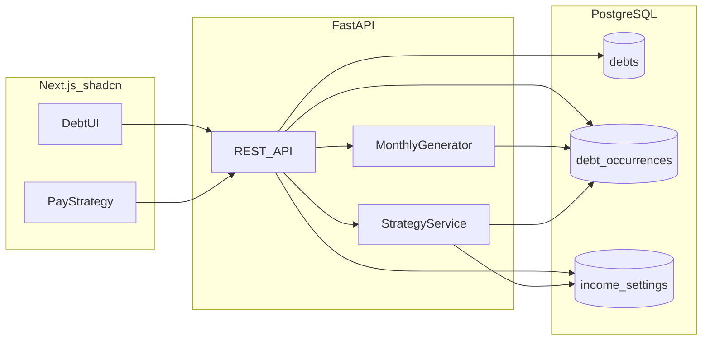
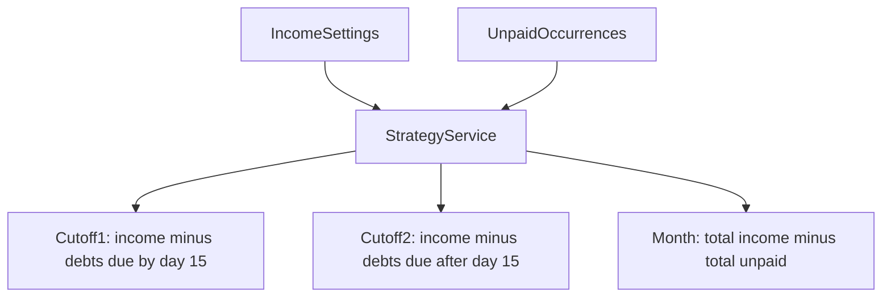
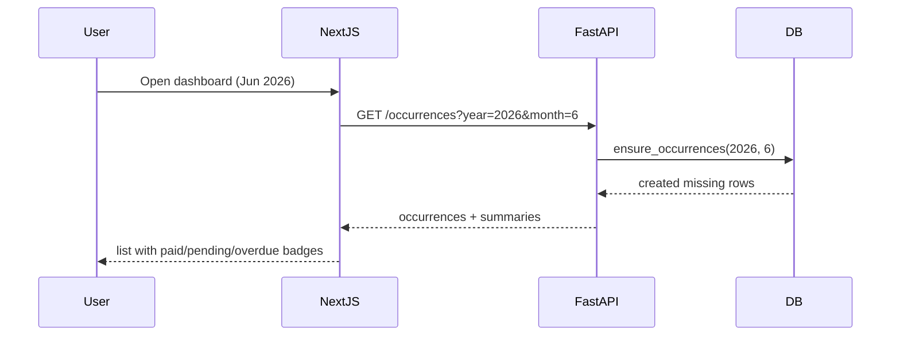
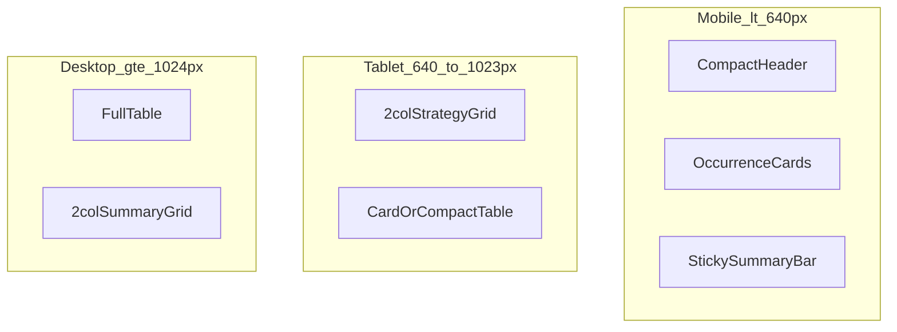

# Debt Tracker (Next.js + FastAPI + PostgreSQL)

## Architecture



- **Monorepo layout** at [`c:\Users\jrparreno\Development\debt_tracker`](c:\Users\jrparreno\Development\debt_tracker):
  - `frontend/` — Next.js 15 (App Router), TypeScript, Tailwind, **shadcn/ui** (all UI components)
  - `backend/` — FastAPI, SQLAlchemy, Alembic
  - `docker-compose.yml` — PostgreSQL for local dev
- No auth in v1 (personal local app). CORS configured for `localhost:3000`.

---

## Debt types (simple enum)

Predefined types — enough variety without complexity:

| Type | Examples |
|------|----------|
| `bnpl` | Atome, Billease, installment plans |
| `utility` | Electricity, water, internet |
| `loan` | Personal loan, car loan |
| `credit_card` | CC minimum or full payment |
| `subscription` | Netflix, gym, insurance |
| `rent` | Rent / mortgage |
| `other` | Catch-all |

---

## Data model

Two tables keep recurring setup separate from monthly tracking:

**`debts`** — define once, reuse every month

- `id`, `name`, `type` (enum), `amount` (decimal), `due_day` (1–28, avoids month-end edge cases)
- `is_active` (bool), `notes` (optional)
- `start_date`, `end_date` (optional — for BNPL/loans with a fixed end)

**`debt_occurrences`** — auto-generated monthly rows

- `id`, `debt_id` (FK), `year`, `month`
- `due_date` (computed from `due_day` + year/month)
- `amount` (copied from debt at generation time — allows future manual override)
- `is_paid` (bool), `paid_at` (nullable timestamp)
- Unique constraint on `(debt_id, year, month)` — one row per debt per month

**Status** is derived (not stored): `paid` if `is_paid`, else `overdue` if `due_date < today`, else `pending`.

**`income_settings`** — single row (no auth in v1; one user)

- `pay_frequency`: `monthly` | `semi_monthly`
- **Monthly mode**: `monthly_amount`, `pay_day` (1–28)
- **Semi-monthly (per cutoff)**: `cutoff_1_day`, `cutoff_1_amount`, `cutoff_2_day`, `cutoff_2_amount` (e.g., 15th ₱25k + 30th ₱25k)
- Editable anytime via a settings dialog; strategy view recalculates immediately

---

## Income and pay strategy

Yes — this is in scope for v1. You set your salary once, and the app shows whether each pay period can cover the debts due in that window.

**How debts map to cutoffs** (automatic, no manual tagging):

| Pay frequency | Bucket rule |
|---------------|-------------|
| `monthly` | All unpaid debts in the month vs one income amount |
| `semi_monthly` | Debts with `due_day <= cutoff_1_day` → Cutoff 1; rest → Cutoff 2 |

**`StrategyService`** ([`backend/app/services/strategy_service.py`](backend/app/services/strategy_service.py)) returns for the selected month:

```json
{
  "total_income": 50000,
  "total_debt_unpaid": 42000,
  "surplus": 8000,
  "periods": [
    {
      "label": "Cutoff 1 (15th)",
      "income": 25000,
      "debts_due": 18000,
      "remaining": 7000,
      "debts": [{ "name": "Meralco", "amount": 3500, "due_date": "2026-06-10" }]
    },
    {
      "label": "Cutoff 2 (30th)",
      "income": 25000,
      "debts_due": 24000,
      "remaining": 1000,
      "debts": [{ "name": "Credit Card", "amount": 12000, "due_date": "2026-06-25" }]
    }
  ]
}
```

- **Green / red indicator**: `remaining >= 0` = affordable; negative = shortfall (shows how much more you need)
- Paid debts are excluded from `debts_due` so strategy reflects what is still left to pay
- Simple v1: no rebalancing suggestions — just clear numbers so you can decide what to pay from which cutoff



---

## Auto-generate monthly tracker (core feature)

You add a debt template once; the backend creates occurrence rows automatically.

**`MonthlyGenerator` service** ([`backend/app/services/monthly_generator.py`](backend/app/services/monthly_generator.py)):

1. For each active `debt` where `start_date <= month` and (`end_date` is null or `end_date >= month`):
2. If no `debt_occurrence` exists for `(debt_id, year, month)`, create one with computed `due_date` and `amount`.
3. Idempotent — safe to call repeatedly.

**When it runs:**

- On `GET /occurrences?year=&month=` (before returning data)
- On `POST /debts` (generate for current month + next 2 months as buffer)
- Optional: `POST /occurrences/generate` for manual refresh

This means opening the app in June auto-creates June rows for all active debts — no manual table entry.



---

## API endpoints (FastAPI)

| Method | Path | Purpose |
|--------|------|---------|
| `GET` | `/debts` | List debt templates |
| `POST` | `/debts` | Create recurring debt + trigger generation |
| `PATCH` | `/debts/{id}` | Edit template (future months pick up new amount) |
| `DELETE` | `/debts/{id}` | Soft-delete (`is_active=false`) |
| `GET` | `/occurrences` | List for month; query params: `year`, `month`, `status`, `type` |
| `PATCH` | `/occurrences/{id}` | Mark paid/unpaid, optional amount override |
| `GET` | `/summary/monthly` | List of `{year, month, total, paid, unpaid}` for last 12 months |
| `GET` | `/summary/current` | Current month totals (used for bottom summary bar) |
| `GET` | `/income` | Get income settings |
| `PATCH` | `/income` | Update pay frequency, amounts, cutoff days |
| `GET` | `/summary/strategy` | Income vs debts per cutoff for `year` + `month` |

---

## UI framework — shadcn/ui

All frontend styling and components use **shadcn/ui** on top of Tailwind (no separate CSS framework).

- Initialize with `npx shadcn@latest init` in `frontend/` — select **New York** style, **Zinc** base color, **CSS variables** enabled
- **Dark mode as default** via `next-themes`:
  - `ThemeProvider` in [`frontend/app/layout.tsx`](frontend/app/layout.tsx) with `defaultTheme="dark"`, `attribute="class"`, `enableSystem={false}`
  - `<html className="dark">` on first paint to avoid flash of light theme
  - Optional **light/dark toggle** in header (shadcn `DropdownMenu` + sun/moon icon) — persists choice in `localStorage`
- Components to install: `button`, `card`, `table`, `badge`, `select`, `dialog`, `sheet`, `switch`, `input`, `label`, `form`, `progress`, `tabs`, `separator`, `alert`, `skeleton`, `sonner` (toasts), `dropdown-menu`
- Currency formatted as PHP (`₱`) via `Intl.NumberFormat`
- Color semantics: green = surplus / paid, amber = pending, red = overdue / shortfall (using shadcn `Badge` variants and `Alert`)

---

## Responsive design and UI/UX

The app is **mobile-first** and fully usable on phone, tablet, and desktop. Layout adapts at Tailwind breakpoints:

| Breakpoint | Width | Layout |
|------------|-------|--------|
| **Mobile** | `< 640px` | Single column, card list, stacked filters |
| **Tablet** | `640px – 1023px` | Two-column strategy cards, wider dialogs |
| **Desktop** | `≥ 1024px` | Max-width container (`max-w-6xl`), full data table, side-by-side panels |

### Per-view behavior

**Mobile**
- Header: compact row — month picker center, icon buttons for Add debt / Income / theme toggle
- Filters: horizontal scroll chips (`All | Pending | Paid | Overdue`) + type `Select` full width
- Occurrence list: **card layout** (not table) — name, badge, due date, amount, paid `Switch` with min **44px** touch targets
- Pay strategy: stacked cutoff cards, collapsible debt lists (`Collapsible` or accordion)
- Bottom summary: **sticky footer bar** with key totals always visible
- Dialogs: full-width `Sheet` (bottom drawer) for Add debt / Income on small screens; `Dialog` on tablet+

**Tablet**
- Strategy cards in **2-column grid**
- Occurrence list: card layout or compact table (hide non-essential columns)
- Filters inline in one row

**Desktop**
- Centered `max-w-6xl` content with comfortable padding
- Occurrence list: full **shadcn `Table`** with all columns
- Strategy + monthly summary in **2-column grid** below the debt list
- Standard centered `Dialog` modals

### Standard UI/UX practices (built in from day one)

- **Visual hierarchy**: page title → month context → strategy summary → actionable list → historical summary
- **Consistent spacing**: 4px grid via Tailwind (`gap-4`, `p-4`, `space-y-4`)
- **Loading states**: shadcn `Skeleton` placeholders while fetching occurrences / strategy
- **Empty states**: friendly message + "Add your first debt" CTA when no debts exist
- **Feedback**: `sonner` toasts on save, mark paid, errors
- **Accessibility**: semantic HTML, `Label` on all inputs, keyboard-navigable dialogs, visible focus rings (shadcn default)
- **Readability in dark mode**: sufficient contrast on cards (`bg-card`, `text-muted-foreground` for secondary text), no pure-black backgrounds — use shadcn zinc dark palette



**Shared layout shell**: [`frontend/components/app-shell.tsx`](frontend/components/app-shell.tsx) wraps all views with responsive padding, header, and sticky summary slot.

---

## Frontend pages (Next.js)

Single main view keeps v1 simple — no multi-page navigation needed.

**[`frontend/app/page.tsx`](frontend/app/page.tsx)** — Dashboard (responsive; see section above)

1. **Header** — month picker (prev/next), "Add debt" + "Income" buttons (icons on mobile), optional theme toggle
2. **Pay strategy card** (top, shadcn `Card` + `Progress`):
   - Per-cutoff breakdown: income, debts due, remaining
   - Month-level surplus/deficit banner (`Alert` if shortfall)
   - Lists which debts fall in each cutoff bucket (collapsible on mobile)
3. **Filters row** — status chips + type dropdown (scrollable on mobile)
4. **Occurrence list** — **cards on mobile/tablet**, **table on desktop**; each row: name, type badge, due date, amount, paid toggle
5. **Bottom summary bar** (sticky on mobile/desktop):
   - This month total debt
   - Paid so far / Still owed
   - Income vs debt comparison for the month
6. **Monthly summary section** — compact table/cards: last 12 months with total per month (tap/click to jump to that month)

**[`frontend/components/add-debt-dialog.tsx`](frontend/components/add-debt-dialog.tsx)** — form: name, type, amount, due day, optional end date (for BNPL). Uses `Sheet` on mobile, `Dialog` on `sm+`.

**[`frontend/components/income-settings-dialog.tsx`](frontend/components/income-settings-dialog.tsx)** — form:

- Pay frequency toggle: Monthly | Semi-monthly (per cutoff)
- Monthly: amount + pay day
- Semi-monthly: two rows (day + amount each)
- Same responsive pattern: `Sheet` on mobile, `Dialog` on `sm+`

---

## Filters

Applied client-side on fetched data + passed as API query params:

- **Status**: `all`, `pending`, `paid`, `overdue`
- **Type**: `all` or specific enum value
- **Month**: month picker (defaults to current month)

---

## Local dev setup

```yaml
# docker-compose.yml
services:
  db:
    image: postgres:16
    ports: ["5432:5432"]
    environment:
      POSTGRES_USER: debt_tracker
      POSTGRES_PASSWORD: debt_tracker
      POSTGRES_DB: debt_tracker
```

- `backend`: `uvicorn app.main:app --reload` on port 8000
- `frontend`: `npm run dev` on port 3000
- Alembic initial migration creates both tables + enum type
- `.env.example` files for `DATABASE_URL` and `NEXT_PUBLIC_API_URL`

---

## Future extension (not in v1)

Designed so **monthly expenses** can be added later as a separate module (`expenses` table + similar monthly generator) without refactoring debts. Shared patterns: recurring template + monthly occurrence + summary API.

---

## Implementation order

1. Scaffold monorepo, Docker Postgres, FastAPI project with models + Alembic migration (debts, occurrences, income_settings)
2. Implement `MonthlyGenerator` + `StrategyService` + all API endpoints
3. Scaffold Next.js, run `shadcn init` (dark theme), add `next-themes` + `ThemeProvider`, install components, API client, `app-shell` layout
4. Build responsive dashboard: month picker, filters, occurrence cards/table, paid toggle, loading/empty states
5. Add income settings dialog/sheet + pay strategy card (cutoff breakdown, collapsible on mobile)
6. Add sticky bottom summary + monthly history section
7. README with setup steps (`docker compose up`, migrate, run both servers)
